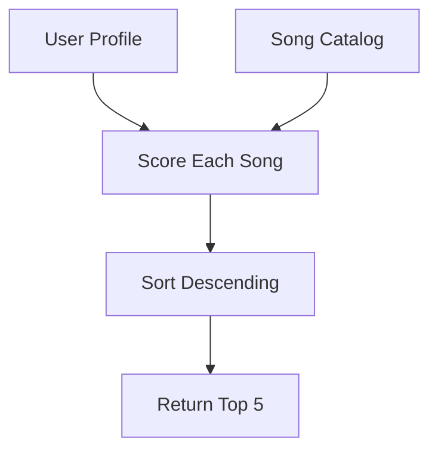

# Music Recommender Simulation

## Project Summary

A content-based music recommender that scores songs against a user taste profile and returns the top 5 matches with explanations. Built to understand how platforms like Spotify decide what to play next — without the black box.

---

## How The System Works

Each `Song` has 10 attributes (genre, mood, energy, tempo, valence, danceability, acousticness, etc.). A `UserProfile` stores four preferences: favorite genre, favorite mood, target energy, and whether they like acoustic sounds.

Every song gets scored using this formula:

```
score = (0.40 × energy_score)
      + (0.25 × mood_score)
      + (0.20 × genre_score)
      + (0.15 × acoustic_score)
```

| Component | How it works |
|-----------|--------------|
| Energy | Gaussian decay — full credit when close to your target, drops off as it drifts |
| Mood | Exact match = 1.0, no match = 0.0 |
| Genre | Same as mood |
| Acoustic | High acousticness is good if you like acoustic, bad if you don't |

Songs are ranked by score and the top 5 are returned with a reason for each.



Real platforms like Spotify also use collaborative filtering (what similar users listen to) and behavior signals like skips. This only does the content side.

---

## Getting Started

```bash
pip install -r requirements.txt
python -m src.main
```

Run tests:

```bash
pytest
```

---

## Experiments You Tried

Tested three profiles: Late Night Focus (lofi/focused/low energy), High-Energy Pop (pop/happy/high energy), and Chill Acoustic (folk/chill/low energy).

The first two both scored 0.97 at #1 — but on totally different songs. When a song hits genre + mood + energy at the same time, it pulls way ahead of everything else. The Chill Acoustic profile was different because folk only appears once in the catalog, so the top result had no genre match at all. It just scored well on energy and acousticness.

**Terminal output:**

```
Loaded 20 songs total.

==================================================
Profile: Late Night Focus
==================================================
  1. Focus Flow by LoRoom
     Score: 0.97
     Why: energy similarity: 1.00, mood match (+0.25), genre match (+0.20), acoustic fit: 0.78

  2. Library Rain by Paper Lanterns
     Score: 0.72
     Why: energy similarity: 0.97, genre match (+0.20), acoustic fit: 0.86

  3. Midnight Coding by LoRoom
     Score: 0.70
     Why: energy similarity: 1.00, genre match (+0.20), acoustic fit: 0.71

  4. Coffee Shop Stories by Slow Stereo
     Score: 0.53
     Why: energy similarity: 0.99, acoustic fit: 0.89

  5. Last Train Blues by Muddy Overcoat
     Score: 0.53
     Why: energy similarity: 1.00, acoustic fit: 0.85

==================================================
Profile: High-Energy Pop
==================================================
  1. Sunrise City by Neon Echo
     Score: 0.97
     Why: energy similarity: 0.99, mood match (+0.25), genre match (+0.20), acoustic fit: 0.82

  2. Gym Hero by Max Pulse
     Score: 0.71
     Why: energy similarity: 0.92, genre match (+0.20), acoustic fit: 0.95

  3. Rooftop Lights by Indigo Parade
     Score: 0.71
     Why: energy similarity: 0.90, mood match (+0.25), acoustic fit: 0.65

  4. Crown the Block by Verse Theory
     Score: 0.54
     Why: energy similarity: 1.00, acoustic fit: 0.92

  5. Storm Runner by Voltline
     Score: 0.52
     Why: energy similarity: 0.96, acoustic fit: 0.90

==================================================
Profile: Chill Acoustic
==================================================
  1. Spacewalk Thoughts by Orbit Bloom
     Score: 0.79
     Why: energy similarity: 1.00, mood match (+0.25), acoustic fit: 0.92

  2. Library Rain by Paper Lanterns
     Score: 0.77
     Why: energy similarity: 0.97, mood match (+0.25), acoustic fit: 0.86

  3. Dirt Road Gospel by The Hollow Pines
     Score: 0.74
     Why: energy similarity: 0.99, genre match (+0.20), acoustic fit: 0.94

  4. Midnight Coding by LoRoom
     Score: 0.69
     Why: energy similarity: 0.84, mood match (+0.25), acoustic fit: 0.71

  5. Cafe Ipanema by Sol Novo Trio
     Score: 0.53
     Why: energy similarity: 1.00, acoustic fit: 0.88
```

**Weight shift:** Doubled energy weight, halved genre — rankings barely changed. Energy was already doing most of the work because the Gaussian decay never hits zero.

**Feature removal:** Removing mood caused two songs to swap in the Late Night Focus list. Library Rain jumped above Midnight Coding because their energy scores were nearly identical and mood had been the tiebreaker.

---

## Limitations and Risks

- Only 20 songs — rare genres get almost no real options
- Genre and mood are binary, so "lofi hip-hop" gets zero credit for a "lofi" preference
- Energy scores never bottom out, so a bad mood/genre match can still rank decently
- No memory — same profile always gives same results
- Pop is overrepresented so pop users get more variety by default

---

## Reflection

[**Model Card**](model_card.md)

The weights I chose aren't facts — they're a guess at what matters most. If that guess is wrong, the system confidently gives bad recommendations with no way to know. The filter bubble thing was the most surprising part: nobody decided to favor pop, it just happened because pop dominates the dataset. That feels like it would be a much bigger problem in a real system where you can't easily see the imbalance.
